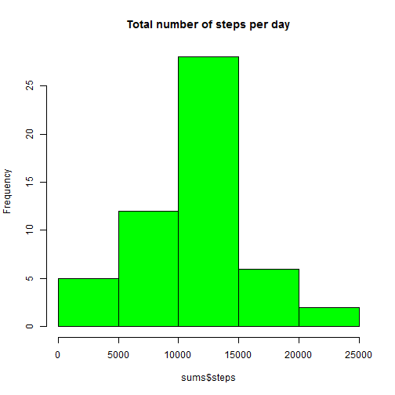
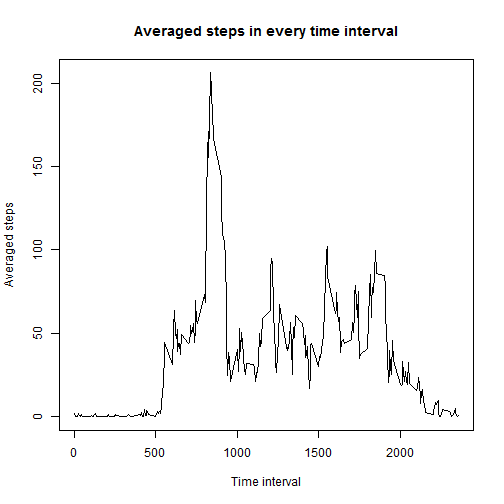
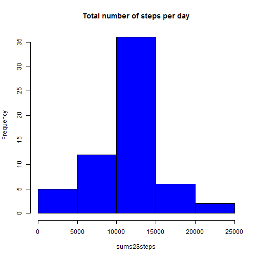
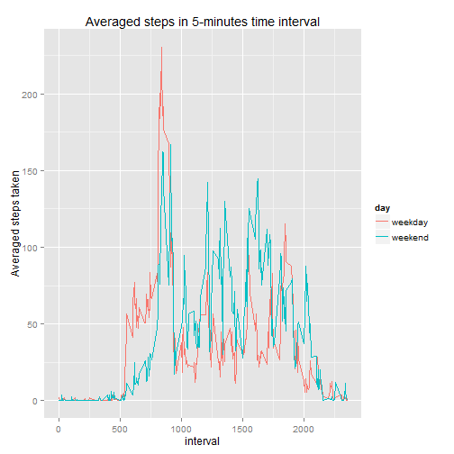

Reproductible research - Course Project 1
=========================================

### 1. What is mean total number of steps taken per day?

Reading the data from working directory (already unzipped), then creating data frame with aggregated (total) number of steps taken per day. Finally creating histogram of total number of steps per day


```r
dane <- read.csv ("activity.csv")
sums <- aggregate (steps ~ date, data=dane, FUN=sum)
hist (sums$steps, col="green", main="Total number of steps per day")
```

 

Now its time to calculate mean and median total number of steps per day 


```r
m1 <- mean(sums$steps) 
med1 <- median (sums$steps)
```

Mean is **1.0766189 &times; 10<sup>4</sup>** and median is **10765**


### 2. What is the average daily activity pattern?

Creating data frame with averaged (accross all days) number of steps per time interval. Than creating a time series plot.


```r
means <- aggregate (steps ~ interval, data=dane, FUN=mean)
plot (means$interval, means$steps, type="l", 
      main="Averaged steps in every time interval",
      xlab="Time interval",
      ylab="Averaged steps")
```

 

Which time inteval contains maximum number of steps?


```r
x <- which.max (means$steps)
means$interval[x]
```

```
## [1] 835
```


### 3. Imputing missing values

Calculating the number of NAs


```r
number_na <- sum(is.na(dane$steps))
```

There is **2304** missing values in a data base

Creating new dataframe (the same as the original one)


```r
dane2 <- read.csv ("activity.csv")
```

Creating a loop which **replace NAs** with averaged value (all days)
for a given time interval


```r
y <- nrow(dane2)
for (i in 1:y) {
      if (is.na(dane2$steps[i])==T) {
            n <- dane2$interval[i]
            dane2$steps[i] <- means[means$interval==n,2]
      }
}
```

Creating histogram for "NA corrected" dataframe and calculating mean and median


```r
sums2 <- aggregate (steps ~ date, data=dane2, FUN=sum)
hist (sums2$steps, col="blue", main="Total number of steps per day")
```

 

```r
m2 <- mean (sums2$steps)
med2 <- median (sums2$steps)
```

After NA correction the mean value remains the same (old: **1.0766189 &times; 10<sup>4</sup>** new: **1.0766189 &times; 10<sup>4</sup>** Theres is a difference in median values (old: **10765**, new: **1.0766189 &times; 10<sup>4</sup>**)


### 4. Are there differences in activity patterns between weekdays and weekends?

Firstly, I loaded *dplyr* package to easier add new variable with days of the week 
(I used *mutate* function). Than I loaded *plyr* package to use *revalue* function
on a names of the week to convert them into "weekday" and "weekend" values. Please
note, that I'm using **polish** version of Windows (I'm a Pole), so the day names
can looks a little bit odd to You. Finally, I converted character variable into
factor variable.


```r
library(dplyr)
dane2 <- dane2 %>% mutate (day=weekdays(as.Date(date)))
library(plyr)
dane2$day <- revalue (dane2$day, c("poniedzia³ek"="weekday", "wtorek"="weekday", 
      "œroda"="weekday", "czwartek"="weekday","pi¹tek"="weekday","sobota"="weekend",
      "niedziela"="weekend"))
dane2$day <- as.factor(dane2$day)
```

Finally, I've created a data frame with aggregated steps for every 5-minute time
interval and weekday (ordinary weekday or weekend), loaded *ggplot2* packaged
and drew the plot.


```r
means_week <- aggregate (steps ~ interval + day, data=dane2, FUN=mean)
library(ggplot2)
ggplot (means_week, aes(x=interval, y=steps, group=day)) + 
      geom_line(aes(colour=day)) +
      ggtitle("Averaged steps in 5-minutes time interval") +
      labs(group="Day of the week", y="Averaged steps taken")
```

 

I've decided to put two plots on one canvas, so You can can see the difference
between weekdays and weekend walking (moving) activity, but if You rather want
2-panel lattice plot (as in example)... Here you are.


```r
library(lattice)
xyplot (steps ~ interval | day, data=means_week, type="l", layout=c(1,2) )
```

 
